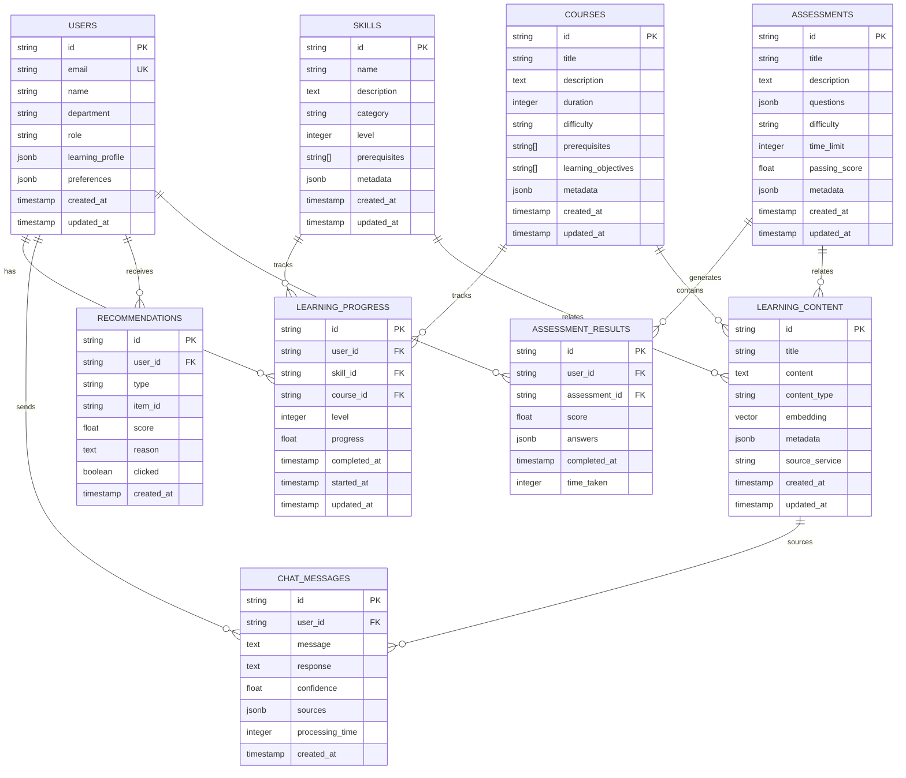

# 🗄️ DATABASE SPECIFICATION DOCUMENT

## 🎯 Database Design Specification

**Project Name**: Contextual Corporate Assistant RAG/GRAPH
**Database Version**: 1.0
**Date**: December 2024
**Status**: Specification

---

## 📊 Database Overview

### Database Technology Stack
- **Primary Database**: PostgreSQL 15+ with pgvector extension
- **Backend Service**: Supabase (PostgreSQL + Auth + Real-time + Storage)
- **Cache Layer**: Redis for high-performance caching
- **Vector Search**: pgvector for similarity search and embeddings
- **ORM**: Prisma for type-safe database access
- **Migrations**: Prisma migrations with version control

### Database Architecture Principles
- **ACID Compliance**: Full transaction support with PostgreSQL
- **Scalability**: Horizontal scaling with read replicas
- **Performance**: Optimized indexes and query performance
- **Security**: Row Level Security (RLS) and encryption
- **Compliance**: GDPR compliance and audit trails
- **Reliability**: Automated backups and disaster recovery

---

## 🏗️ Database Schema Design

### 1. Core Entity Relationships



### 2. Table Specifications

#### Users Table
```sql
CREATE TABLE users (
    id TEXT PRIMARY KEY DEFAULT gen_random_uuid()::text,
    email TEXT UNIQUE NOT NULL,
    name TEXT NOT NULL,
    department TEXT,
    role TEXT CHECK (role IN ('learner', 'hr_manager', 'trainer', 'admin')),
    learning_profile JSONB,
    preferences JSONB,
    created_at TIMESTAMP WITH TIME ZONE DEFAULT NOW(),
    updated_at TIMESTAMP WITH TIME ZONE DEFAULT NOW()
);

-- Indexes
CREATE INDEX idx_users_email ON users(email);
CREATE INDEX idx_users_department ON users(department);
CREATE INDEX idx_users_role ON users(role);
CREATE INDEX idx_users_created_at ON users(created_at);

-- GIN indexes for JSONB columns
CREATE INDEX idx_users_learning_profile ON users USING GIN (learning_profile);
CREATE INDEX idx_users_preferences ON users USING GIN (preferences);
```

#### Learning Content Table (with pgvector)
```sql
CREATE TABLE learning_content (
    id TEXT PRIMARY KEY DEFAULT gen_random_uuid()::text,
    title TEXT NOT NULL,
    content TEXT NOT NULL,
    content_type TEXT NOT NULL CHECK (content_type IN ('course', 'lesson', 'skill', 'assessment', 'tutorial', 'reference')),
    embedding VECTOR(1536), -- OpenAI embedding dimension
    metadata JSONB,
    source_service TEXT, -- Which microservice this came from
    created_at TIMESTAMP WITH TIME ZONE DEFAULT NOW(),
    updated_at TIMESTAMP WITH TIME ZONE DEFAULT NOW()
);

-- Indexes
CREATE INDEX idx_learning_content_type ON learning_content(content_type);
CREATE INDEX idx_learning_content_source ON learning_content(source_service);
CREATE INDEX idx_learning_content_created ON learning_content(created_at);
CREATE INDEX idx_learning_content_metadata ON learning_content USING GIN (metadata);

-- Vector similarity search index
CREATE INDEX ON learning_content USING ivfflat (embedding vector_cosine_ops)
WITH (lists = 100);
```

#### Skills Table
```sql
CREATE TABLE skills (
    id TEXT PRIMARY KEY DEFAULT gen_random_uuid()::text,
    name TEXT NOT NULL,
    description TEXT,
    category TEXT,
    level INTEGER DEFAULT 1 CHECK (level >= 1 AND level <= 5),
    prerequisites TEXT[], -- Array of prerequisite skill IDs
    metadata JSONB,
    created_at TIMESTAMP WITH TIME ZONE DEFAULT NOW(),
    updated_at TIMESTAMP WITH TIME ZONE DEFAULT NOW()
);

-- Indexes
CREATE INDEX idx_skills_category ON skills(category);
CREATE INDEX idx_skills_level ON skills(level);
CREATE INDEX idx_skills_name ON skills(name);
CREATE INDEX idx_skills_metadata ON skills USING GIN (metadata);
```

#### Courses Table
```sql
CREATE TABLE courses (
    id TEXT PRIMARY KEY DEFAULT gen_random_uuid()::text,
    title TEXT NOT NULL,
    description TEXT,
    duration INTEGER, -- Duration in minutes
    difficulty TEXT CHECK (difficulty IN ('beginner', 'intermediate', 'advanced')),
    prerequisites TEXT[], -- Array of prerequisite skill/course IDs
    learning_objectives TEXT[],
    metadata JSONB,
    created_at TIMESTAMP WITH TIME ZONE DEFAULT NOW(),
    updated_at TIMESTAMP WITH TIME ZONE DEFAULT NOW()
);

-- Indexes
CREATE INDEX idx_courses_difficulty ON courses(difficulty);
CREATE INDEX idx_courses_duration ON courses(duration);
CREATE INDEX idx_courses_title ON courses(title);
CREATE INDEX idx_courses_metadata ON courses USING GIN (metadata);
```

#### Learning Progress Table
```sql
CREATE TABLE learning_progress (
    id TEXT PRIMARY KEY DEFAULT gen_random_uuid()::text,
    user_id TEXT NOT NULL REFERENCES users(id) ON DELETE CASCADE,
    skill_id TEXT REFERENCES skills(id) ON DELETE SET NULL,
    course_id TEXT REFERENCES courses(id) ON DELETE SET NULL,
    level INTEGER DEFAULT 1 CHECK (level >= 1 AND level <= 5),
    progress FLOAT DEFAULT 0 CHECK (progress >= 0 AND progress <= 100),
    completed_at TIMESTAMP WITH TIME ZONE,
    started_at TIMESTAMP WITH TIME ZONE DEFAULT NOW(),
    updated_at TIMESTAMP WITH TIME ZONE DEFAULT NOW(),
    
    -- Ensure only one progress record per user-skill or user-course
    CONSTRAINT unique_user_skill UNIQUE (user_id, skill_id),
    CONSTRAINT unique_user_course UNIQUE (user_id, course_id)
);

-- Indexes
CREATE INDEX idx_learning_progress_user ON learning_progress(user_id);
CREATE INDEX idx_learning_progress_skill ON learning_progress(skill_id);
CREATE INDEX idx_learning_progress_course ON learning_progress(course_id);
CREATE INDEX idx_learning_progress_completed ON learning_progress(completed_at);
CREATE INDEX idx_learning_progress_started ON learning_progress(started_at);

-- Composite indexes for common queries
CREATE INDEX idx_learning_progress_user_skill ON learning_progress(user_id, skill_id);
CREATE INDEX idx_learning_progress_user_course ON learning_progress(user_id, course_id);

-- Partial indexes for performance
CREATE INDEX idx_learning_progress_active ON learning_progress(user_id) 
WHERE completed_at IS NULL;
```

#### Chat Messages Table
```sql
CREATE TABLE chat_messages (
    id TEXT PRIMARY KEY DEFAULT gen_random_uuid()::text,
    user_id TEXT NOT NULL REFERENCES users(id) ON DELETE CASCADE,
    message TEXT NOT NULL,
    response TEXT,
    confidence FLOAT CHECK (confidence >= 0 AND confidence <= 1),
    sources JSONB, -- Array of source documents
    processing_time INTEGER, -- Processing time in milliseconds
    created_at TIMESTAMP WITH TIME ZONE DEFAULT NOW()
);

-- Indexes
CREATE INDEX idx_chat_messages_user ON chat_messages(user_id);
CREATE INDEX idx_chat_messages_created ON chat_messages(created_at);
CREATE INDEX idx_chat_messages_confidence ON chat_messages(confidence);
CREATE INDEX idx_chat_messages_sources ON chat_messages USING GIN (sources);

-- Composite index for user chat history
CREATE INDEX idx_chat_messages_user_created ON chat_messages(user_id, created_at);

-- Partial index for recent messages
CREATE INDEX idx_chat_messages_recent ON chat_messages(user_id, created_at) 
WHERE created_at > NOW() - INTERVAL '30 days';
```

#### Recommendations Table
```sql
CREATE TABLE recommendations (
    id TEXT PRIMARY KEY DEFAULT gen_random_uuid()::text,
    user_id TEXT NOT NULL REFERENCES users(id) ON DELETE CASCADE,
    type TEXT NOT NULL CHECK (type IN ('skill', 'course', 'content')),
    item_id TEXT NOT NULL,
    score FLOAT NOT NULL CHECK (score >= 0 AND score <= 1),
    reason TEXT,
    clicked BOOLEAN DEFAULT FALSE,
    created_at TIMESTAMP WITH TIME ZONE DEFAULT NOW()
);

-- Indexes
CREATE INDEX idx_recommendations_user ON recommendations(user_id);
CREATE INDEX idx_recommendations_type ON recommendations(type);
CREATE INDEX idx_recommendations_score ON recommendations(score);
CREATE INDEX idx_recommendations_created ON recommendations(created_at);

-- Composite indexes
CREATE INDEX idx_recommendations_user_type ON recommendations(user_id, type);
CREATE INDEX idx_recommendations_user_score ON recommendations(user_id, score DESC);
```

#### Assessments Table
```sql
CREATE TABLE assessments (
    id TEXT PRIMARY KEY DEFAULT gen_random_uuid()::text,
    title TEXT NOT NULL,
    description TEXT,
    questions JSONB, -- Array of question objects
    difficulty TEXT CHECK (difficulty IN ('beginner', 'intermediate', 'advanced')),
    time_limit INTEGER, -- Time limit in minutes
    passing_score FLOAT DEFAULT 70 CHECK (passing_score >= 0 AND passing_score <= 100),
    metadata JSONB,
    created_at TIMESTAMP WITH TIME ZONE DEFAULT NOW(),
    updated_at TIMESTAMP WITH TIME ZONE DEFAULT NOW()
);

-- Indexes
CREATE INDEX idx_assessments_difficulty ON assessments(difficulty);
CREATE INDEX idx_assessments_title ON assessments(title);
CREATE INDEX idx_assessments_questions ON assessments USING GIN (questions);
CREATE INDEX idx_assessments_metadata ON assessments USING GIN (metadata);
```

#### Assessment Results Table
```sql
CREATE TABLE assessment_results (
    id TEXT PRIMARY KEY DEFAULT gen_random_uuid()::text,
    user_id TEXT NOT NULL REFERENCES users(id) ON DELETE CASCADE,
    assessment_id TEXT NOT NULL REFERENCES assessments(id) ON DELETE CASCADE,
    score FLOAT NOT NULL CHECK (score >= 0 AND score <= 100),
    answers JSONB, -- User's answers
    completed_at TIMESTAMP WITH TIME ZONE DEFAULT NOW(),
    time_taken INTEGER, -- Time taken in seconds
    
    -- Ensure only one result per user-assessment
    CONSTRAINT unique_user_assessment UNIQUE (user_id, assessment_id)
);

-- Indexes
CREATE INDEX idx_assessment_results_user ON assessment_results(user_id);
CREATE INDEX idx_assessment_results_assessment ON assessment_results(assessment_id);
CREATE INDEX idx_assessment_results_score ON assessment_results(score);
CREATE INDEX idx_assessment_results_completed ON assessment_results(completed_at);
CREATE INDEX idx_assessment_results_answers ON assessment_results USING GIN (answers);
```

---

## 🔧 Database Functions and Procedures

### 1. Vector Similarity Search Function
```sql
-- Function for vector similarity search using pgvector
CREATE OR REPLACE FUNCTION match_documents (
    query_embedding VECTOR(1536),
    match_threshold FLOAT DEFAULT 0.7,
    match_count INT DEFAULT 5,
    content_types TEXT[] DEFAULT NULL
)
RETURNS TABLE (
    id TEXT,
    title TEXT,
    content TEXT,
    content_type TEXT,
    similarity FLOAT,
    metadata JSONB
)
LANGUAGE SQL STABLE
AS $$
    SELECT
        lc.id,
        lc.title,
        lc.content,
        lc.content_type,
        1 - (lc.embedding <=> query_embedding) AS similarity,
        lc.metadata
    FROM learning_content lc
    WHERE lc.embedding IS NOT NULL
        AND 1 - (lc.embedding <=> query_embedding) > match_threshold
        AND (content_types IS NULL OR lc.content_type = ANY(content_types))
    ORDER BY lc.embedding <=> query_embedding
    LIMIT match_count;
$$;
```

### 2. User Learning Analytics Function
```sql
-- Function to get comprehensive user learning analytics
CREATE OR REPLACE FUNCTION get_user_learning_analytics(user_id_param TEXT)
RETURNS TABLE (
    total_skills INTEGER,
    completed_skills INTEGER,
    total_courses INTEGER,
    completed_courses INTEGER,
    total_progress FLOAT,
    recent_activity JSONB,
    skill_distribution JSONB,
    learning_velocity FLOAT
)
LANGUAGE SQL STABLE
AS $$
    SELECT
        COUNT(DISTINCT lp.skill_id)::INTEGER as total_skills,
        COUNT(DISTINCT CASE WHEN lp.progress = 100 THEN lp.skill_id END)::INTEGER as completed_skills,
        COUNT(DISTINCT lp.course_id)::INTEGER as total_courses,
        COUNT(DISTINCT CASE WHEN lp.progress = 100 THEN lp.course_id END)::INTEGER as completed_courses,
        COALESCE(AVG(lp.progress), 0) as total_progress,
        jsonb_build_object(
            'recent_messages', (
                SELECT COUNT(*) FROM chat_messages cm 
                WHERE cm.user_id = user_id_param 
                AND cm.created_at > NOW() - INTERVAL '7 days'
            ),
            'recent_progress', (
                SELECT COUNT(*) FROM learning_progress lp2 
                WHERE lp2.user_id = user_id_param 
                AND lp2.updated_at > NOW() - INTERVAL '7 days'
            ),
            'recent_recommendations', (
                SELECT COUNT(*) FROM recommendations r 
                WHERE r.user_id = user_id_param 
                AND r.created_at > NOW() - INTERVAL '7 days'
            )
        ) as recent_activity,
        (
            SELECT jsonb_object_agg(s.category, skill_count)
            FROM (
                SELECT s.category, COUNT(*) as skill_count
                FROM learning_progress lp
                JOIN skills s ON lp.skill_id = s.id
                WHERE lp.user_id = user_id_param
                GROUP BY s.category
            ) s
        ) as skill_distribution,
        (
            SELECT AVG(EXTRACT(EPOCH FROM (lp.completed_at - lp.started_at)) / 3600)
            FROM learning_progress lp
            WHERE lp.user_id = user_id_param 
            AND lp.completed_at IS NOT NULL
            AND lp.completed_at > NOW() - INTERVAL '30 days'
        ) as learning_velocity
    FROM learning_progress lp
    WHERE lp.user_id = user_id_param;
$$;
```

### 3. Recommendation Generation Function
```sql
-- Function to generate personalized recommendations
CREATE OR REPLACE FUNCTION generate_recommendations(
    user_id_param TEXT,
    limit_count INTEGER DEFAULT 10
)
RETURNS TABLE (
    id TEXT,
    type TEXT,
    title TEXT,
    description TEXT,
    score FLOAT,
    reason TEXT
)
LANGUAGE SQL STABLE
AS $$
    WITH user_profile AS (
        SELECT learning_profile, preferences
        FROM users
        WHERE id = user_id_param
    ),
    user_skills AS (
        SELECT skill_id, level, progress
        FROM learning_progress
        WHERE user_id = user_id_param AND skill_id IS NOT NULL
    ),
    user_courses AS (
        SELECT course_id, progress
        FROM learning_progress
        WHERE user_id = user_id_param AND course_id IS NOT NULL
    ),
    skill_recommendations AS (
        SELECT 
            s.id,
            'skill'::TEXT as type,
            s.name as title,
            s.description,
            CASE 
                WHEN EXISTS(SELECT 1 FROM user_skills us WHERE us.skill_id = s.id) THEN 0.3
                WHEN EXISTS(SELECT 1 FROM user_skills us WHERE us.skill_id = ANY(s.prerequisites)) THEN 0.7
                ELSE 0.8
            END as score,
            CASE 
                WHEN EXISTS(SELECT 1 FROM user_skills us WHERE us.skill_id = s.id) THEN 'Continue developing this skill'
                WHEN EXISTS(SELECT 1 FROM user_skills us WHERE us.skill_id = ANY(s.prerequisites)) THEN 'Prerequisites met - ready to learn'
                ELSE 'Recommended based on your learning profile'
            END as reason
        FROM skills s
        WHERE NOT EXISTS(SELECT 1 FROM user_skills us WHERE us.skill_id = s.id AND us.progress = 100)
        ORDER BY s.level ASC, s.name ASC
        LIMIT limit_count / 2
    ),
    course_recommendations AS (
        SELECT 
            c.id,
            'course'::TEXT as type,
            c.title,
            c.description,
            CASE 
                WHEN EXISTS(SELECT 1 FROM user_courses uc WHERE uc.course_id = c.id AND uc.progress = 100) THEN 0.2
                WHEN EXISTS(SELECT 1 FROM user_courses uc WHERE uc.course_id = c.id) THEN 0.5
                ELSE 0.7
            END as score,
            CASE 
                WHEN EXISTS(SELECT 1 FROM user_courses uc WHERE uc.course_id = c.id AND uc.progress = 100) THEN 'Already completed'
                WHEN EXISTS(SELECT 1 FROM user_courses uc WHERE uc.course_id = c.id) THEN 'Continue this course'
                ELSE 'Course matches your skill development goals'
            END as reason
        FROM courses c
        WHERE NOT EXISTS(SELECT 1 FROM user_courses uc WHERE uc.course_id = c.id AND uc.progress = 100)
        ORDER BY c.difficulty ASC, c.title ASC
        LIMIT limit_count / 2
    )
    SELECT * FROM skill_recommendations
    UNION ALL
    SELECT * FROM course_recommendations
    ORDER BY score DESC, title ASC
    LIMIT limit_count;
$$;
```

### 4. Content Search Function
```sql
-- Function for full-text search across learning content
CREATE OR REPLACE FUNCTION search_learning_content(
    search_query TEXT,
    content_types TEXT[] DEFAULT NULL,
    limit_count INTEGER DEFAULT 20
)
RETURNS TABLE (
    id TEXT,
    title TEXT,
    content TEXT,
    content_type TEXT,
    relevance_score FLOAT,
    metadata JSONB
)
LANGUAGE SQL STABLE
AS $$
    SELECT
        lc.id,
        lc.title,
        lc.content,
        lc.content_type,
        ts_rank(
            to_tsvector('english', lc.title || ' ' || lc.content),
            plainto_tsquery('english', search_query)
        ) as relevance_score,
        lc.metadata
    FROM learning_content lc
    WHERE to_tsvector('english', lc.title || ' ' || lc.content) @@ plainto_tsquery('english', search_query)
        AND (content_types IS NULL OR lc.content_type = ANY(content_types))
    ORDER BY relevance_score DESC, lc.created_at DESC
    LIMIT limit_count;
$$;
```

---

## 🔐 Row Level Security (RLS) Policies

### 1. Users Table Policies
```sql
-- Enable RLS on users table
ALTER TABLE users ENABLE ROW LEVEL SECURITY;

-- Users can view and update their own profile
CREATE POLICY "Users can view own profile" ON users
    FOR SELECT USING (auth.uid()::text = id);

CREATE POLICY "Users can update own profile" ON users
    FOR UPDATE USING (auth.uid()::text = id);

-- Service role can manage all users
CREATE POLICY "Service role can manage users" ON users
    FOR ALL USING (auth.role() = 'service_role');

-- HR Managers can view users in their department
CREATE POLICY "HR Managers can view department users" ON users
    FOR SELECT USING (
        auth.uid()::text IN (
            SELECT id FROM users 
            WHERE role = 'hr_manager' 
            AND department = users.department
        )
    );
```

### 2. Learning Content Policies
```sql
-- Enable RLS on learning content table
ALTER TABLE learning_content ENABLE ROW LEVEL SECURITY;

-- All authenticated users can read learning content
CREATE POLICY "Authenticated users can read learning content" ON learning_content
    FOR SELECT USING (auth.role() = 'authenticated');

-- Service role can manage learning content
CREATE POLICY "Service role can manage learning content" ON learning_content
    FOR ALL USING (auth.role() = 'service_role');

-- Trainers can manage content they created
CREATE POLICY "Trainers can manage own content" ON learning_content
    FOR ALL USING (
        auth.uid()::text IN (
            SELECT id FROM users 
            WHERE role = 'trainer'
        )
        AND metadata->>'created_by' = auth.uid()::text
    );
```

### 3. Learning Progress Policies
```sql
-- Enable RLS on learning progress table
ALTER TABLE learning_progress ENABLE ROW LEVEL SECURITY;

-- Users can view and update their own progress
CREATE POLICY "Users can view own progress" ON learning_progress
    FOR SELECT USING (auth.uid()::text = user_id);

CREATE POLICY "Users can update own progress" ON learning_progress
    FOR ALL USING (auth.uid()::text = user_id);

-- Service role can manage all progress
CREATE POLICY "Service role can manage progress" ON learning_progress
    FOR ALL USING (auth.role() = 'service_role');

-- HR Managers can view progress of users in their department
CREATE POLICY "HR Managers can view department progress" ON learning_progress
    FOR SELECT USING (
        user_id IN (
            SELECT id FROM users 
            WHERE department = (
                SELECT department FROM users WHERE id = auth.uid()::text
            )
        )
    );
```

### 4. Chat Messages Policies
```sql
-- Enable RLS on chat messages table
ALTER TABLE chat_messages ENABLE ROW LEVEL SECURITY;

-- Users can view and insert their own messages
CREATE POLICY "Users can view own messages" ON chat_messages
    FOR SELECT USING (auth.uid()::text = user_id);

CREATE POLICY "Users can insert own messages" ON chat_messages
    FOR INSERT WITH CHECK (auth.uid()::text = user_id);

-- Service role can manage all messages
CREATE POLICY "Service role can manage messages" ON chat_messages
    FOR ALL USING (auth.role() = 'service_role');

-- Admins can view all messages for support
CREATE POLICY "Admins can view all messages" ON chat_messages
    FOR SELECT USING (
        auth.uid()::text IN (
            SELECT id FROM users WHERE role = 'admin'
        )
    );
```

### 5. Recommendations Policies
```sql
-- Enable RLS on recommendations table
ALTER TABLE recommendations ENABLE ROW LEVEL SECURITY;

-- Users can view their own recommendations
CREATE POLICY "Users can view own recommendations" ON recommendations
    FOR SELECT USING (auth.uid()::text = user_id);

CREATE POLICY "Users can update own recommendations" ON recommendations
    FOR UPDATE USING (auth.uid()::text = user_id);

-- Service role can manage all recommendations
CREATE POLICY "Service role can manage recommendations" ON recommendations
    FOR ALL USING (auth.role() = 'service_role');
```

---

## 🔄 Database Triggers

### 1. Update Timestamp Trigger
```sql
-- Function to update updated_at timestamp
CREATE OR REPLACE FUNCTION update_updated_at_column()
RETURNS TRIGGER AS $$
BEGIN
    NEW.updated_at = NOW();
    RETURN NEW;
END;
$$ language 'plpgsql';

-- Apply trigger to all tables with updated_at column
CREATE TRIGGER update_users_updated_at BEFORE UPDATE ON users
    FOR EACH ROW EXECUTE FUNCTION update_updated_at_column();

CREATE TRIGGER update_learning_content_updated_at BEFORE UPDATE ON learning_content
    FOR EACH ROW EXECUTE FUNCTION update_updated_at_column();

CREATE TRIGGER update_skills_updated_at BEFORE UPDATE ON skills
    FOR EACH ROW EXECUTE FUNCTION update_updated_at_column();

CREATE TRIGGER update_courses_updated_at BEFORE UPDATE ON courses
    FOR EACH ROW EXECUTE FUNCTION update_updated_at_column();

CREATE TRIGGER update_learning_progress_updated_at BEFORE UPDATE ON learning_progress
    FOR EACH ROW EXECUTE FUNCTION update_updated_at_column();

CREATE TRIGGER update_assessments_updated_at BEFORE UPDATE ON assessments
    FOR EACH ROW EXECUTE FUNCTION update_updated_at_column();
```

### 2. Learning Progress Completion Trigger
```sql
-- Function to handle learning progress completion
CREATE OR REPLACE FUNCTION handle_progress_completion()
RETURNS TRIGGER AS $$
BEGIN
    -- Set completed_at when progress reaches 100%
    IF NEW.progress = 100 AND OLD.progress < 100 THEN
        NEW.completed_at = NOW();
        
        -- Log completion event
        INSERT INTO audit_log (
            table_name,
            record_id,
            action,
            user_id,
            changes
        ) VALUES (
            'learning_progress',
            NEW.id,
            'completed',
            NEW.user_id,
            jsonb_build_object(
                'skill_id', NEW.skill_id,
                'course_id', NEW.course_id,
                'level', NEW.level
            )
        );
    END IF;
    
    RETURN NEW;
END;
$$ language 'plpgsql';

CREATE TRIGGER learning_progress_completion_trigger
    BEFORE UPDATE ON learning_progress
    FOR EACH ROW EXECUTE FUNCTION handle_progress_completion();
```

### 3. Chat Message Processing Trigger
```sql
-- Function to handle chat message processing
CREATE OR REPLACE FUNCTION handle_chat_message()
RETURNS TRIGGER AS $$
BEGIN
    -- Update user activity timestamp
    UPDATE users 
    SET updated_at = NOW() 
    WHERE id = NEW.user_id;
    
    -- Log message for analytics
    INSERT INTO analytics_events (
        event_type,
        user_id,
        metadata
    ) VALUES (
        'chat_message',
        NEW.user_id,
        jsonb_build_object(
            'message_length', length(NEW.message),
            'has_response', NEW.response IS NOT NULL,
            'confidence', NEW.confidence,
            'processing_time', NEW.processing_time
        )
    );
    
    RETURN NEW;
END;
$$ language 'plpgsql';

CREATE TRIGGER chat_message_processing_trigger
    AFTER INSERT ON chat_messages
    FOR EACH ROW EXECUTE FUNCTION handle_chat_message();
```

---

## 📊 Database Views

### 1. User Learning Dashboard View
```sql
-- View for comprehensive user learning dashboard
CREATE VIEW user_learning_dashboard AS
SELECT 
    u.id,
    u.name,
    u.email,
    u.department,
    u.role,
    COALESCE(stats.total_skills, 0) as total_skills,
    COALESCE(stats.completed_skills, 0) as completed_skills,
    COALESCE(stats.total_courses, 0) as total_courses,
    COALESCE(stats.completed_courses, 0) as completed_courses,
    COALESCE(stats.total_progress, 0) as overall_progress,
    COALESCE(recent_messages.count, 0) as recent_messages,
    COALESCE(recent_progress.count, 0) as recent_progress_updates,
    COALESCE(stats.learning_velocity, 0) as learning_velocity
FROM users u
LEFT JOIN LATERAL get_user_learning_analytics(u.id) stats ON true
LEFT JOIN LATERAL (
    SELECT COUNT(*) as count
    FROM chat_messages cm
    WHERE cm.user_id = u.id
    AND cm.created_at > NOW() - INTERVAL '7 days'
) recent_messages ON true
LEFT JOIN LATERAL (
    SELECT COUNT(*) as count
    FROM learning_progress lp
    WHERE lp.user_id = u.id
    AND lp.updated_at > NOW() - INTERVAL '7 days'
) recent_progress ON true;
```

### 2. Learning Content Search View
```sql
-- View for learning content search with metadata
CREATE VIEW learning_content_search AS
SELECT 
    lc.id,
    lc.title,
    lc.content,
    lc.content_type,
    lc.source_service,
    lc.metadata,
    lc.created_at,
    lc.updated_at,
    CASE 
        WHEN lc.content_type = 'course' THEN c.difficulty
        WHEN lc.content_type = 'skill' THEN s.level::TEXT
        ELSE NULL
    END as difficulty_level,
    CASE 
        WHEN lc.content_type = 'course' THEN c.duration
        ELSE NULL
    END as duration,
    CASE 
        WHEN lc.content_type = 'course' THEN c.learning_objectives
        ELSE NULL
    END as learning_objectives
FROM learning_content lc
LEFT JOIN courses c ON lc.metadata->>'course_id' = c.id
LEFT JOIN skills s ON lc.metadata->>'skill_id' = s.id;
```

### 3. Recommendation Analytics View
```sql
-- View for recommendation analytics and performance
CREATE VIEW recommendation_analytics AS
SELECT 
    r.type,
    r.item_id,
    COUNT(*) as total_recommendations,
    COUNT(CASE WHEN r.clicked = true THEN 1 END) as clicks,
    ROUND(
        COUNT(CASE WHEN r.clicked = true THEN 1 END)::FLOAT / COUNT(*) * 100, 2
    ) as click_rate,
    AVG(r.score) as avg_score,
    COUNT(DISTINCT r.user_id) as unique_users
FROM recommendations r
WHERE r.created_at > NOW() - INTERVAL '30 days'
GROUP BY r.type, r.item_id
ORDER BY click_rate DESC, total_recommendations DESC;
```

---

## 🔧 Database Migrations

### 1. Initial Migration Script
```sql
-- Migration: 001_initial_schema.sql
-- Description: Create initial database schema with all tables, indexes, and constraints

-- Enable required extensions
CREATE EXTENSION IF NOT EXISTS "uuid-ossp";
CREATE EXTENSION IF NOT EXISTS "vector";

-- Create users table
CREATE TABLE users (
    id TEXT PRIMARY KEY DEFAULT gen_random_uuid()::text,
    email TEXT UNIQUE NOT NULL,
    name TEXT NOT NULL,
    department TEXT,
    role TEXT CHECK (role IN ('learner', 'hr_manager', 'trainer', 'admin')),
    learning_profile JSONB,
    preferences JSONB,
    created_at TIMESTAMP WITH TIME ZONE DEFAULT NOW(),
    updated_at TIMESTAMP WITH TIME ZONE DEFAULT NOW()
);

-- Create skills table
CREATE TABLE skills (
    id TEXT PRIMARY KEY DEFAULT gen_random_uuid()::text,
    name TEXT NOT NULL,
    description TEXT,
    category TEXT,
    level INTEGER DEFAULT 1 CHECK (level >= 1 AND level <= 5),
    prerequisites TEXT[],
    metadata JSONB,
    created_at TIMESTAMP WITH TIME ZONE DEFAULT NOW(),
    updated_at TIMESTAMP WITH TIME ZONE DEFAULT NOW()
);

-- Create courses table
CREATE TABLE courses (
    id TEXT PRIMARY KEY DEFAULT gen_random_uuid()::text,
    title TEXT NOT NULL,
    description TEXT,
    duration INTEGER,
    difficulty TEXT CHECK (difficulty IN ('beginner', 'intermediate', 'advanced')),
    prerequisites TEXT[],
    learning_objectives TEXT[],
    metadata JSONB,
    created_at TIMESTAMP WITH TIME ZONE DEFAULT NOW(),
    updated_at TIMESTAMP WITH TIME ZONE DEFAULT NOW()
);

-- Create learning content table
CREATE TABLE learning_content (
    id TEXT PRIMARY KEY DEFAULT gen_random_uuid()::text,
    title TEXT NOT NULL,
    content TEXT NOT NULL,
    content_type TEXT NOT NULL CHECK (content_type IN ('course', 'lesson', 'skill', 'assessment', 'tutorial', 'reference')),
    embedding VECTOR(1536),
    metadata JSONB,
    source_service TEXT,
    created_at TIMESTAMP WITH TIME ZONE DEFAULT NOW(),
    updated_at TIMESTAMP WITH TIME ZONE DEFAULT NOW()
);

-- Create learning progress table
CREATE TABLE learning_progress (
    id TEXT PRIMARY KEY DEFAULT gen_random_uuid()::text,
    user_id TEXT NOT NULL REFERENCES users(id) ON DELETE CASCADE,
    skill_id TEXT REFERENCES skills(id) ON DELETE SET NULL,
    course_id TEXT REFERENCES courses(id) ON DELETE SET NULL,
    level INTEGER DEFAULT 1 CHECK (level >= 1 AND level <= 5),
    progress FLOAT DEFAULT 0 CHECK (progress >= 0 AND progress <= 100),
    completed_at TIMESTAMP WITH TIME ZONE,
    started_at TIMESTAMP WITH TIME ZONE DEFAULT NOW(),
    updated_at TIMESTAMP WITH TIME ZONE DEFAULT NOW(),
    CONSTRAINT unique_user_skill UNIQUE (user_id, skill_id),
    CONSTRAINT unique_user_course UNIQUE (user_id, course_id)
);

-- Create chat messages table
CREATE TABLE chat_messages (
    id TEXT PRIMARY KEY DEFAULT gen_random_uuid()::text,
    user_id TEXT NOT NULL REFERENCES users(id) ON DELETE CASCADE,
    message TEXT NOT NULL,
    response TEXT,
    confidence FLOAT CHECK (confidence >= 0 AND confidence <= 1),
    sources JSONB,
    processing_time INTEGER,
    created_at TIMESTAMP WITH TIME ZONE DEFAULT NOW()
);

-- Create recommendations table
CREATE TABLE recommendations (
    id TEXT PRIMARY KEY DEFAULT gen_random_uuid()::text,
    user_id TEXT NOT NULL REFERENCES users(id) ON DELETE CASCADE,
    type TEXT NOT NULL CHECK (type IN ('skill', 'course', 'content')),
    item_id TEXT NOT NULL,
    score FLOAT NOT NULL CHECK (score >= 0 AND score <= 1),
    reason TEXT,
    clicked BOOLEAN DEFAULT FALSE,
    created_at TIMESTAMP WITH TIME ZONE DEFAULT NOW()
);

-- Create assessments table
CREATE TABLE assessments (
    id TEXT PRIMARY KEY DEFAULT gen_random_uuid()::text,
    title TEXT NOT NULL,
    description TEXT,
    questions JSONB,
    difficulty TEXT CHECK (difficulty IN ('beginner', 'intermediate', 'advanced')),
    time_limit INTEGER,
    passing_score FLOAT DEFAULT 70 CHECK (passing_score >= 0 AND passing_score <= 100),
    metadata JSONB,
    created_at TIMESTAMP WITH TIME ZONE DEFAULT NOW(),
    updated_at TIMESTAMP WITH TIME ZONE DEFAULT NOW()
);

-- Create assessment results table
CREATE TABLE assessment_results (
    id TEXT PRIMARY KEY DEFAULT gen_random_uuid()::text,
    user_id TEXT NOT NULL REFERENCES users(id) ON DELETE CASCADE,
    assessment_id TEXT NOT NULL REFERENCES assessments(id) ON DELETE CASCADE,
    score FLOAT NOT NULL CHECK (score >= 0 AND score <= 100),
    answers JSONB,
    completed_at TIMESTAMP WITH TIME ZONE DEFAULT NOW(),
    time_taken INTEGER,
    CONSTRAINT unique_user_assessment UNIQUE (user_id, assessment_id)
);

-- Create audit log table
CREATE TABLE audit_log (
    id TEXT PRIMARY KEY DEFAULT gen_random_uuid()::text,
    table_name TEXT NOT NULL,
    record_id TEXT NOT NULL,
    action TEXT NOT NULL,
    user_id TEXT,
    changes JSONB,
    created_at TIMESTAMP WITH TIME ZONE DEFAULT NOW()
);

-- Create analytics events table
CREATE TABLE analytics_events (
    id TEXT PRIMARY KEY DEFAULT gen_random_uuid()::text,
    event_type TEXT NOT NULL,
    user_id TEXT,
    metadata JSONB,
    created_at TIMESTAMP WITH TIME ZONE DEFAULT NOW()
);
```

### 2. Indexes Migration Script
```sql
-- Migration: 002_create_indexes.sql
-- Description: Create all database indexes for performance optimization

-- Users table indexes
CREATE INDEX idx_users_email ON users(email);
CREATE INDEX idx_users_department ON users(department);
CREATE INDEX idx_users_role ON users(role);
CREATE INDEX idx_users_created_at ON users(created_at);
CREATE INDEX idx_users_learning_profile ON users USING GIN (learning_profile);
CREATE INDEX idx_users_preferences ON users USING GIN (preferences);

-- Skills table indexes
CREATE INDEX idx_skills_category ON skills(category);
CREATE INDEX idx_skills_level ON skills(level);
CREATE INDEX idx_skills_name ON skills(name);
CREATE INDEX idx_skills_metadata ON skills USING GIN (metadata);

-- Courses table indexes
CREATE INDEX idx_courses_difficulty ON courses(difficulty);
CREATE INDEX idx_courses_duration ON courses(duration);
CREATE INDEX idx_courses_title ON courses(title);
CREATE INDEX idx_courses_metadata ON courses USING GIN (metadata);

-- Learning content table indexes
CREATE INDEX idx_learning_content_type ON learning_content(content_type);
CREATE INDEX idx_learning_content_source ON learning_content(source_service);
CREATE INDEX idx_learning_content_created ON learning_content(created_at);
CREATE INDEX idx_learning_content_metadata ON learning_content USING GIN (metadata);

-- Vector similarity search index
CREATE INDEX ON learning_content USING ivfflat (embedding vector_cosine_ops)
WITH (lists = 100);

-- Learning progress table indexes
CREATE INDEX idx_learning_progress_user ON learning_progress(user_id);
CREATE INDEX idx_learning_progress_skill ON learning_progress(skill_id);
CREATE INDEX idx_learning_progress_course ON learning_progress(course_id);
CREATE INDEX idx_learning_progress_completed ON learning_progress(completed_at);
CREATE INDEX idx_learning_progress_started ON learning_progress(started_at);
CREATE INDEX idx_learning_progress_user_skill ON learning_progress(user_id, skill_id);
CREATE INDEX idx_learning_progress_user_course ON learning_progress(user_id, course_id);
CREATE INDEX idx_learning_progress_active ON learning_progress(user_id) 
WHERE completed_at IS NULL;

-- Chat messages table indexes
CREATE INDEX idx_chat_messages_user ON chat_messages(user_id);
CREATE INDEX idx_chat_messages_created ON chat_messages(created_at);
CREATE INDEX idx_chat_messages_confidence ON chat_messages(confidence);
CREATE INDEX idx_chat_messages_sources ON chat_messages USING GIN (sources);
CREATE INDEX idx_chat_messages_user_created ON chat_messages(user_id, created_at);
CREATE INDEX idx_chat_messages_recent ON chat_messages(user_id, created_at) 
WHERE created_at > NOW() - INTERVAL '30 days';

-- Recommendations table indexes
CREATE INDEX idx_recommendations_user ON recommendations(user_id);
CREATE INDEX idx_recommendations_type ON recommendations(type);
CREATE INDEX idx_recommendations_score ON recommendations(score);
CREATE INDEX idx_recommendations_created ON recommendations(created_at);
CREATE INDEX idx_recommendations_user_type ON recommendations(user_id, type);
CREATE INDEX idx_recommendations_user_score ON recommendations(user_id, score DESC);

-- Assessments table indexes
CREATE INDEX idx_assessments_difficulty ON assessments(difficulty);
CREATE INDEX idx_assessments_title ON assessments(title);
CREATE INDEX idx_assessments_questions ON assessments USING GIN (questions);
CREATE INDEX idx_assessments_metadata ON assessments USING GIN (metadata);

-- Assessment results table indexes
CREATE INDEX idx_assessment_results_user ON assessment_results(user_id);
CREATE INDEX idx_assessment_results_assessment ON assessment_results(assessment_id);
CREATE INDEX idx_assessment_results_score ON assessment_results(score);
CREATE INDEX idx_assessment_results_completed ON assessment_results(completed_at);
CREATE INDEX idx_assessment_results_answers ON assessment_results USING GIN (answers);

-- Audit log table indexes
CREATE INDEX idx_audit_log_table ON audit_log(table_name);
CREATE INDEX idx_audit_log_user ON audit_log(user_id);
CREATE INDEX idx_audit_log_created ON audit_log(created_at);
CREATE INDEX idx_audit_log_changes ON audit_log USING GIN (changes);

-- Analytics events table indexes
CREATE INDEX idx_analytics_events_type ON analytics_events(event_type);
CREATE INDEX idx_analytics_events_user ON analytics_events(user_id);
CREATE INDEX idx_analytics_events_created ON analytics_events(created_at);
CREATE INDEX idx_analytics_events_metadata ON analytics_events USING GIN (metadata);
```

---

## 🌱 Data Seeding Scripts

### 1. Initial Data Seeding
```sql
-- Seed script: 001_initial_data.sql
-- Description: Insert initial sample data for development and testing

-- Insert sample skills
INSERT INTO skills (name, description, category, level) VALUES
('Python Programming', 'Python programming language skills', 'Technical', 1),
('Machine Learning', 'Machine learning algorithms and techniques', 'Technical', 2),
('Data Analysis', 'Data analysis and visualization skills', 'Technical', 2),
('Project Management', 'Project management methodologies', 'Management', 1),
('Communication', 'Effective communication skills', 'Soft Skills', 1),
('Leadership', 'Leadership and team management', 'Management', 2),
('JavaScript', 'JavaScript programming and web development', 'Technical', 1),
('React Development', 'React framework for web applications', 'Technical', 2),
('Database Design', 'Database design and optimization', 'Technical', 2),
('Agile Methodology', 'Agile project management practices', 'Management', 1);

-- Insert sample courses
INSERT INTO courses (title, description, duration, difficulty, learning_objectives) VALUES
('Python Fundamentals', 'Learn Python programming basics', 480, 'beginner', ARRAY['Variables and data types', 'Control structures', 'Functions', 'Modules']),
('Machine Learning Basics', 'Introduction to machine learning concepts', 720, 'intermediate', ARRAY['Supervised learning', 'Unsupervised learning', 'Model evaluation', 'Feature engineering']),
('Data Analysis with Python', 'Data analysis using Python libraries', 600, 'intermediate', ARRAY['Pandas basics', 'Data visualization', 'Statistical analysis', 'Data cleaning']),
('Project Management Fundamentals', 'Essential project management skills', 360, 'beginner', ARRAY['Project planning', 'Risk management', 'Team coordination', 'Timeline management']),
('Advanced JavaScript', 'Advanced JavaScript concepts and patterns', 540, 'intermediate', ARRAY['ES6+ features', 'Async programming', 'Design patterns', 'Performance optimization']),
('React Development', 'Building web applications with React', 600, 'intermediate', ARRAY['Component lifecycle', 'State management', 'Routing', 'Testing']),
('Database Design', 'Database design principles and best practices', 480, 'intermediate', ARRAY['Normalization', 'Indexing', 'Query optimization', 'Data modeling']),
('Agile Project Management', 'Agile methodologies and practices', 420, 'beginner', ARRAY['Scrum framework', 'Sprint planning', 'Retrospectives', 'Team collaboration']);

-- Insert sample learning content
INSERT INTO learning_content (title, content, content_type, source_service, metadata) VALUES
('Python Variables', 'Variables in Python are containers for storing data values. Unlike other programming languages, Python has no command for declaring a variable. A variable is created the moment you first assign a value to it.', 'tutorial', 'content-studio', '{"difficulty": "beginner", "tags": ["python", "basics", "variables"]}'),
('Machine Learning Overview', 'Machine learning is a subset of artificial intelligence that focuses on algorithms that can learn from data. It includes supervised learning, unsupervised learning, and reinforcement learning approaches.', 'tutorial', 'content-studio', '{"difficulty": "intermediate", "tags": ["ml", "ai", "algorithms"]}'),
('Data Visualization Best Practices', 'Effective data visualization helps communicate insights clearly. Key principles include choosing appropriate chart types, using consistent colors, and ensuring accessibility.', 'reference', 'content-studio', '{"difficulty": "intermediate", "tags": ["visualization", "data", "design"]}'),
('Project Planning Techniques', 'Successful project planning involves several key steps: defining objectives, identifying tasks, estimating resources, creating timelines, and managing risks.', 'tutorial', 'course-builder', '{"difficulty": "beginner", "tags": ["project", "planning", "management"]}'),
('JavaScript ES6 Features', 'ES6 introduced many new features to JavaScript including arrow functions, template literals, destructuring, and classes. These features make JavaScript more powerful and easier to use.', 'tutorial', 'content-studio', '{"difficulty": "intermediate", "tags": ["javascript", "es6", "modern"]}'),
('React Component Lifecycle', 'React components have a lifecycle that includes mounting, updating, and unmounting phases. Understanding these phases helps optimize component performance and manage side effects.', 'tutorial', 'content-studio', '{"difficulty": "intermediate", "tags": ["react", "components", "lifecycle"]}'),
('Database Normalization', 'Database normalization is the process of organizing data to reduce redundancy and improve data integrity. The main normal forms are 1NF, 2NF, and 3NF.', 'reference', 'content-studio', '{"difficulty": "intermediate", "tags": ["database", "normalization", "design"]}'),
('Scrum Framework', 'Scrum is an agile framework for managing complex projects. It includes roles (Product Owner, Scrum Master, Development Team), events (Sprint, Daily Scrum), and artifacts (Product Backlog, Sprint Backlog).', 'tutorial', 'course-builder', '{"difficulty": "beginner", "tags": ["scrum", "agile", "framework"]}');

-- Insert sample assessments
INSERT INTO assessments (title, description, difficulty, time_limit, passing_score, questions) VALUES
('Python Basics Assessment', 'Test your knowledge of Python fundamentals', 'beginner', 30, 70, '[
    {
        "id": "q1",
        "question": "What is the correct way to create a variable in Python?",
        "type": "multiple_choice",
        "options": ["var x = 5", "x = 5", "int x = 5", "variable x = 5"],
        "correct": 1
    },
    {
        "id": "q2",
        "question": "Which keyword is used to define a function in Python?",
        "type": "multiple_choice",
        "options": ["function", "def", "func", "define"],
        "correct": 1
    }
]'),
('Machine Learning Concepts', 'Assessment on machine learning fundamentals', 'intermediate', 45, 75, '[
    {
        "id": "q1",
        "question": "What is the difference between supervised and unsupervised learning?",
        "type": "multiple_choice",
        "options": ["Supervised uses labeled data", "Unsupervised uses labeled data", "No difference", "Both use unlabeled data"],
        "correct": 0
    }
]'),
('Project Management Fundamentals', 'Test your project management knowledge', 'beginner', 25, 65, '[
    {
        "id": "q1",
        "question": "What is the first phase of project management?",
        "type": "multiple_choice",
        "options": ["Planning", "Execution", "Initiation", "Monitoring"],
        "correct": 2
    }
]');
```

---

## 📈 Performance Optimization

### 1. Query Optimization Strategies
- **Index Usage**: Proper index selection and maintenance
- **Query Planning**: EXPLAIN ANALYZE for query optimization
- **Connection Pooling**: Efficient database connection management
- **Caching**: Redis for frequently accessed data
- **Partitioning**: Table partitioning for large datasets

### 2. Monitoring and Maintenance
- **Performance Monitoring**: Query performance tracking
- **Index Maintenance**: Regular index analysis and optimization
- **Statistics Updates**: Keep table statistics current
- **Vacuum Operations**: Regular database maintenance
- **Backup Verification**: Regular backup testing

---

## 🔒 Security and Compliance

### 1. Data Encryption
- **At Rest**: Supabase automatic encryption
- **In Transit**: TLS/SSL encryption
- **Field Level**: Sensitive data encryption
- **Key Management**: Secure key rotation

### 2. Access Control
- **Authentication**: Supabase Auth integration
- **Authorization**: Row Level Security policies
- **Role Management**: Granular permission system
- **Audit Logging**: Comprehensive access tracking

### 3. Compliance Requirements
- **GDPR**: Data privacy and right to be forgotten
- **Corporate Policies**: Internal compliance requirements
- **Audit Trails**: Complete change tracking
- **Data Retention**: Automated data lifecycle management

---

## 🔄 Backup and Recovery

### 1. Backup Strategy
- **Frequency**: Daily automated backups
- **Retention**: 30-day retention policy
- **Verification**: Regular backup testing
- **Cross-Region**: Geographic redundancy

### 2. Recovery Procedures
- **RTO**: 4-hour recovery time objective
- **RPO**: 1-hour recovery point objective
- **Failover**: Automated failover procedures
- **Testing**: Regular disaster recovery testing

---

**Document Status**: Specification Complete
**Last Updated**: December 2024
**Next Review**: Implementation and Testing
**Approved By**: [Name and Title]


